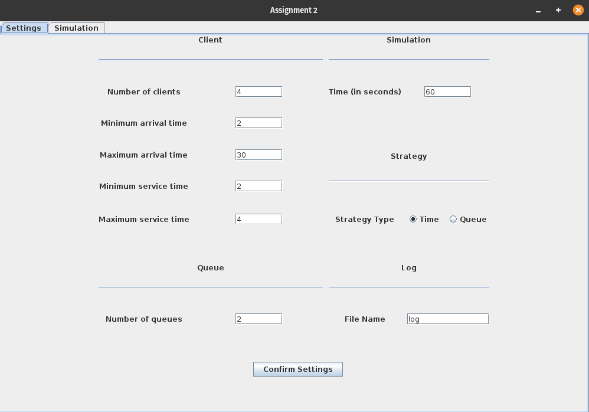

# Queue Management App

An app which assigns clients to queues such that the waiting time is minimised.

## Description
The app has a GUI that has 2 tabs, one for the simulation where the current time and clients and queues are shown,
and another tab where the app's parameters can be set.

## Visuals

